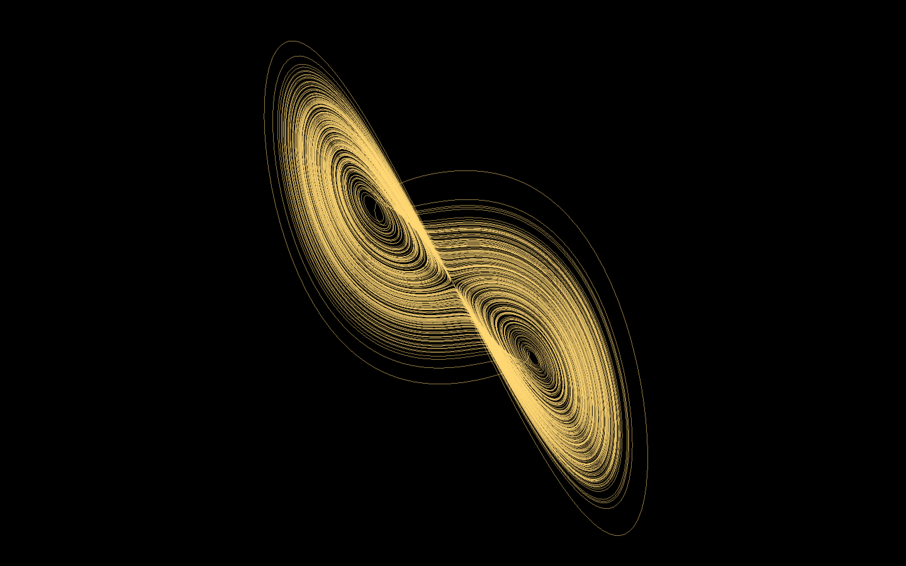
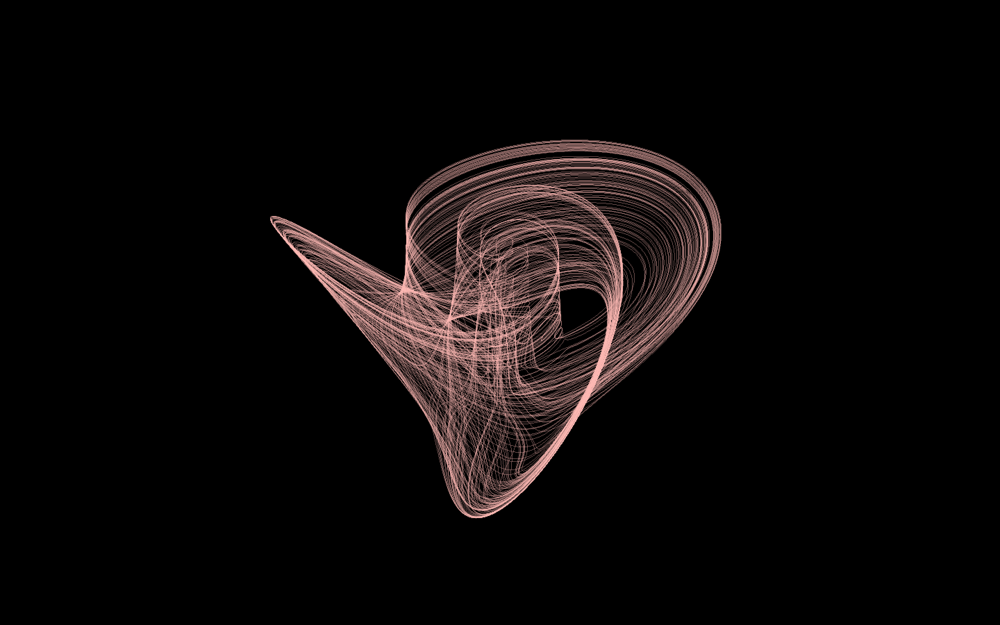

# Chaotic-Dynamical-Systems
This repository contains a collection of simulations of chaotic attractors, written in C++ and Simple and Fast Multimedia Library(SFML).

## Getting Started
### Cloning the repository
```
git clone https://github.com/TheoJJF/Chaotic-Dynamical-Systems.git
```

### Ensuring SFML is installed
For installation and documentations, please visit the [SFML website](https://www.sfml-dev.org/).

## Lorenz Attractor
<p align="center">
    
</p>

### System
$$\dfrac{dx}{dt}=\sigma(-x+y)$$
$$\dfrac{dy}{dt}=-xz+\rho x-y$$
$$\dfrac{dz}{dt}=xy-\beta z$$


### Parameters
$$\sigma=10,\rho=28,\beta=\dfrac{8}{3}$$


## Halvorsen Attractor
<p align="center">
    
</p>

### System
$$\dfrac{dx}{dt}=-ax-4y-4z-y^2$$
$$\dfrac{dy}{dt}=-ay-4z-4x-z^2$$
$$\dfrac{dz}{dt}=-az-4x-4y-x^2$$


### Parameters
$$a=1.4$$

