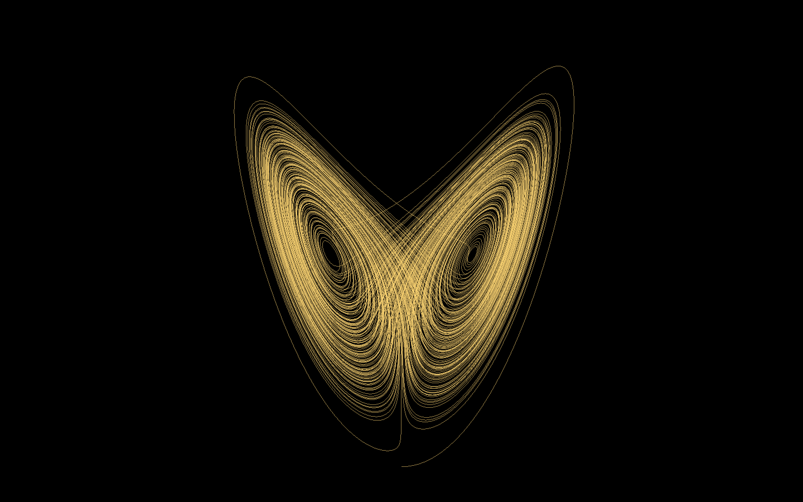
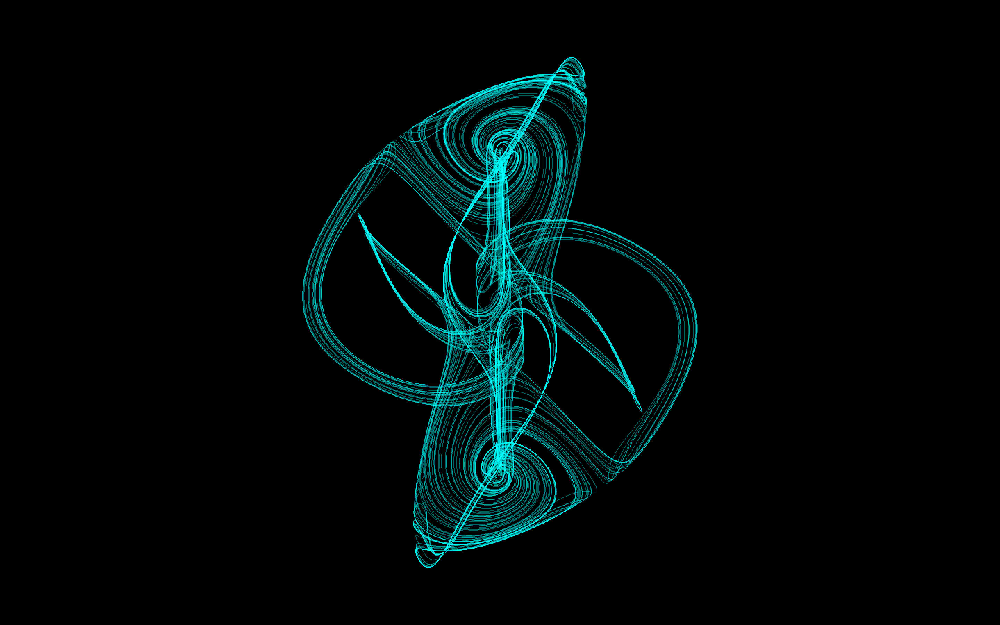

# Chaos
This repository contains simulations of chaotic attractors, written in C++ and Simple and Fast Multimedia Library(SFML).

## Getting Started
### Cloning the repository
```
git clone https://github.com/TheoJJF/Chaos.git
```

### Ensuring SFML is installed
For installation and documentations, please visit the [SFML website](https://www.sfml-dev.org/).

### Ensuring CMake is installed
For installation and documentations, please visit the [CMake website](https://cmake.org/).

### Building with CMake
Using the command line:
```
cmake -S . -B build -DCMAKE_BUILD_TYPE=Release
cmake --build build
```

### Running the executable
```
./build/bin/chaos_exe
```

### Basic Selections
```
esc - Terminating program
1 - Lorenz Attractor
2 - Thomas Attractor
3 - Halvorsen Attractor
```


<div align="center">
    <h2>Chaotic Attractors</h2>
</div>
<div align="center">
    <h3>Lorenz Attractor</h3> 
    <p>
        
    </p>
</div>


<div align="center">
    <h3>System</h3> 
</div>

$$\dfrac{dx}{dt}=\sigma(-x+y)$$

$$\dfrac{dy}{dt}=-xz+\rho x-y$$

$$\dfrac{dz}{dt}=xy-\beta z$$


<div align="center">
    <h3>Parameters</h3> 
</div>

$$\sigma=10,\rho=28,\beta=\dfrac{8}{3}$$

<br>
<div align="center">
    <h3>Thomas Attractor</h3>
    <p>
        
    </p>
</div>

<div align="center">
    <h3>System</h3> 
</div>

$$\dfrac{dx}{dt}=sin(y)-bx$$

$$\dfrac{dy}{dt}=sin(z)-by$$

$$\dfrac{dz}{dt}=sin(x)-bz$$

<div align="center">
    <h3>Parameters</h3> 
</div>

$$b=0.19$$

<br>
<div align="center">
    <h3>Halvorsen Attractor</h3> 
    <p>
        
    </p>
</div>

<div align="center">
    <h3>System</h3> 
</div>

$$\dfrac{dx}{dt}=-ax-4y-4z-y^2$$

$$\dfrac{dy}{dt}=-ay-4z-4x-z^2$$

$$\dfrac{dz}{dt}=-az-4x-4y-x^2$$


<div align="center">
    <h3>Parameters</h3> 
</div>

$$a=1.4$$

